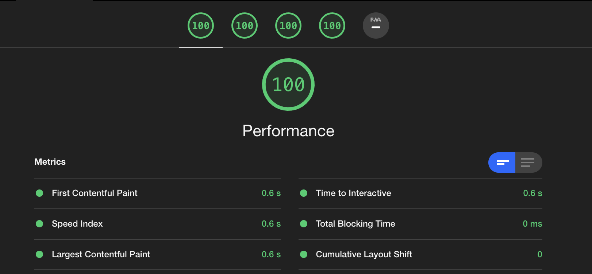
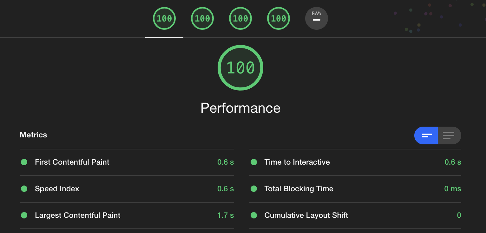
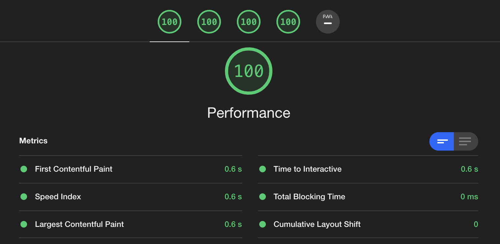
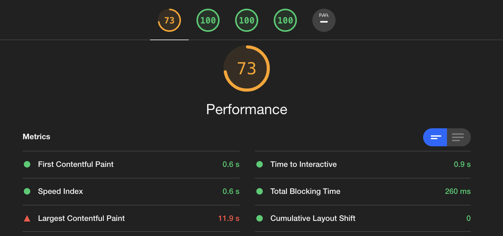
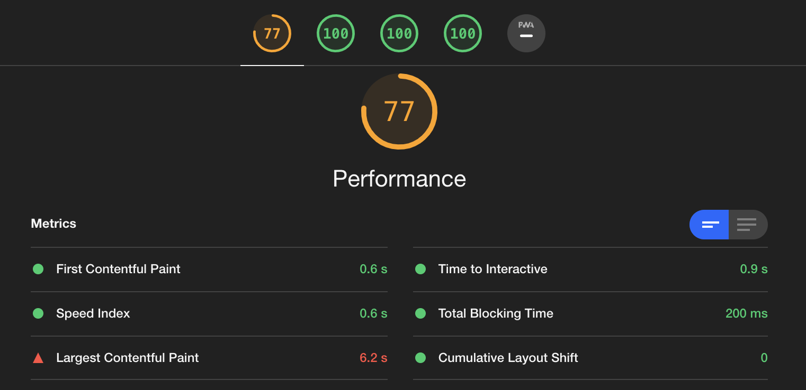
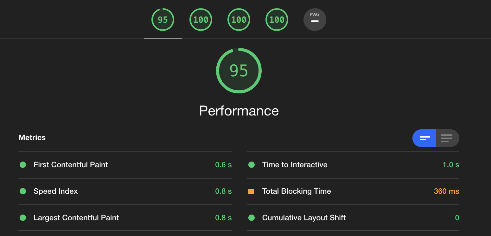

# WebVitals from a developer point of view

Intro...

## My measurement method

Browser Chrome (obviously).

I quickly realized that Some Chrome plugins have an impact on the Lighthouse score.

**Rule 1: Use a Chrome incognito window.**

I use [http-server](https://github.com/http-party/http-server) to server my simple html files.

To measure the score, I simply used the "Lighthouse" tab from Chrome Developer Tools. When doing the tests today, Lighthouse version is still v7.2.0. I will run the same tests on v8.0 with the online version to compare.

## Iteration #1: simple 100 example

Goal is to create a start point: a very basic webpage (with some text and images) with a Lighthouse source of 100.

First step: dump some "Lorem ipsum" paragraphs in a web page. No styling, no fancy stuff.

With a really "text" only page, hitting 100 is very simple. The Performance metric is 100. To go to 100 for the Accessibility / Best Practices and SEO, just apply the feedback provided in the report.

[Live example](https://main--webvitals--kptdobe.hlx.live/simple/)

**Rule 2: to fix the Accessiblity and SEO scores, just do what the report tells you to do**

## Iteration #2: add images (JPG)

Goal is to add a "hero" image (LCP) and several other images below in the page.

The hero image will be visible above the follow thus it will become the Large Contentful Paint element. It must be shown as quickly as possible and its final dimension and position. Treating this image right is one the most critical part of the whole WebVitals story: if it is loaded fast and does not move afterward, there are chances that the Performance will be high.

Images require a width and a height. At least the LCP image. Not setting w/h means that the aspect ratio is unknown and the browser must load the image before it knows the space required by the image. In the meantime, it affects a default space and when image is loaded, re-size that space which impact the CLS - layout changes! You can set them on the image itself or via CSS but it is key for the browser to know how to display it.

I'll show later a technique on how to load the LCP image if you do not know in advance its aspect ratio and do not impact the score.

### Correct browser cache

While it does not impact the score, I already see the red flag `Serve static assets with an efficient cache policy - 3 resources found`. Initially, I used the default `http-server` command line to start the server. Increasing the Time To Live of the asset will solve that problem: `http-server-c36000000`

[Live example](https://main--webvitals--kptdobe.hlx.live/with_jpg/)

## Iteration #3: convert images to webp

The size of the images I initially used is not so big, especially when transfered locally. But I wanted to see the difference on the report by using Webp. 
The first step was to convert the jpg images into webp. I used Google converter cli - https://developers.google.com/speed/webp/download.

The size of the images is then divided by more than 2 which is a lot of octets less to transport. And while the score stays at 100, there is a noticeable difference: the LCP time went from 1.7s to 0.6s which is a more than 50% improvement! My project images are small I could imagine that on larger images, this would have a bigger impact.

[Live example](https://main--webvitals--kptdobe.hlx.live/with_webp/)

## Iteration #4: use larger images

Since my images were pretty small, I decided to run similar tests with larger images. That's when I realized that the Chrome embed Lighthouse score is not reliable: the second time I run it, it gives a much better score (100 in these cases). This gives the feeling images get cached and second run is than much faster. I'll run the same tests with the online tools to see if they are more reliable.

Once the first run, I get for a test with larger JPG images: score 73 with a scary 11.9s for the LCP.

[Live example](https://main--webvitals--kptdobe.hlx.live/with_large_jpg/)

For the same test with larger Webp images: score 77 with a similarily scary 6.2 for the LCP.

[Live example](https://main--webvitals--kptdobe.hlx.live/with_large_webp/)

Those long LCP times are really strange, especially that in my test page, the first image (even in its large version) is not really big. I have one suspicion: on mobile, the second image appears above the fold and since it is defined to `lazy` load, it must be the LCP and degrade the score.
I have tried multiple solutions, like switch from the loading from `lazy` to `eager`, output the LCP in the console, but it will not do it, the LCP loading stays bad and the tool keeps telling me my smaller image is the LCP.

[Live example](https://main--webvitals--kptdobe.hlx.live/with_large_webp/index_debug_LCP.html)

Final test: I swapped the 2 first images and score jumps to 95!

[Live example](https://main--webvitals--kptdobe.hlx.live/with_large_webp2/)

This is insaine and I start doubting about the tool. It is time to go on-line and use [web.dev](https://web.dev/measure/) and [PageSpeed Insights](https://developers.google.com/speed/pagespeed/insights/).
